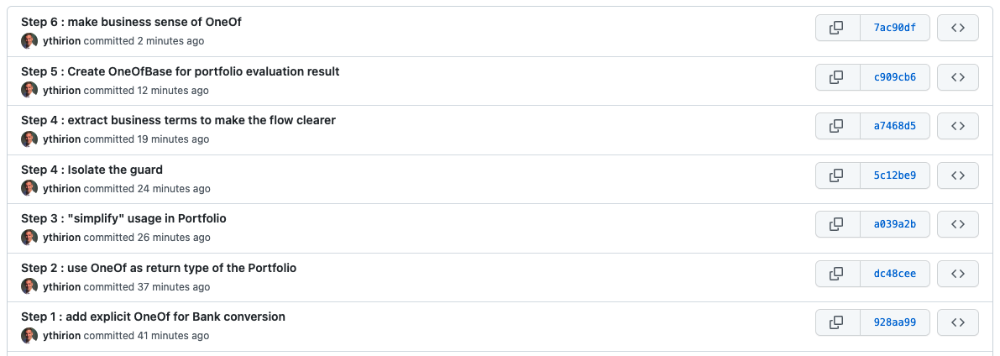

# Oneof money problem
A small kata to experiment discriminated unions for C#, using a custom type `OneOf<T0, ... Tn>`.
An instance of this type holds a single value, which is one of the types in its generic argument list.

Due to exhaustive matching DUs provide an alternative to polymorphism when you want to have a method with guaranteed behaviour-per-type (i.e. adding an abstract method on a base type, and then implementing that method in each type). 

more about [OneOf](https://github.com/mcintyre321/OneOf)

## How to
- Take a few minutes to inspect the code
- Identify where the code contains `lies`
- Refactor using `OneOf`

## Reflect
- What has been the impact on the code? (production and consumer code)

## Step by step guide
The steps I have followed are available in the git history of this branch


## Discriminated Unions
```fsharp
type conversionResult =
    | Money of Money
    | MissingExchangeRate of string

type evaluationResult =
    | Money of Money
    | ExchangeRates of string List
```
